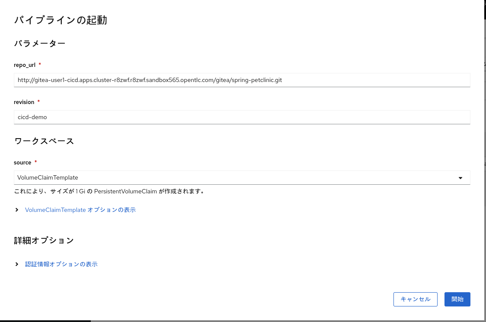

# OpenShift CI/CD Handson

## はじめに

このハンズオンは OpenShift 上で CI/CD を構築、実行する方法を実際に体験して理解することを目的としています。

以下の流れで CI/CD を構築していきます。

1. OpenShift Web Console のパイプラインビルダー上で GUI ベースで CI パイプラインを構築
2. OpenShift Web Console 上からパイプラインを実行できることを確認
3. GitOps によるアプリケーションのデプロイ動作確認

## ハンズオン環境

- OpenShift v4.12
- OpenShift Pipelines v1.10
- OpenShift GitOps v1.8

<details>
<summary>ハンズオン講師向け環境構築手順</summary>

1. OpenShift v4.12 クラスタをプロビジョニング
2. `user1` - `userN` のユーザをハンズオン参加者 + ハンズオン講師用に用意
3. CLI から `cluster-admin` 権限のユーザで OpenShift にログイン
4. OpenShift Pipelines Operator および OpenShift GitOps Operator をインストール
5. [`openshift-cicd-demo`](https://github.com/siamaksade/openshift-cicd-demo) リポジトリを clone
6. ファイルの内容を以下のように変更

```diff
diff --git a/demo.sh b/demo.sh
index 94e2c87..95db3d4 100755
--- a/demo.sh
+++ b/demo.sh
@@ -237,6 +237,14 @@ EOF
   oc label ns $stage_prj argocd.argoproj.io/managed-by=$cicd_prj
 
   oc project $cicd_prj
+  oc -n $cicd_prj apply -f http://$GITEA_HOSTNAME/gitea/spring-petclinic/raw/branch/cicd-demo/.tekton/tasks/create-promote-pr.yaml
+  oc -n $cicd_prj apply -f http://$GITEA_HOSTNAME/gitea/spring-petclinic/raw/branch/cicd-demo/.tekton/tasks/git-update-deployment.yaml
+  oc -n $cicd_prj apply -f http://$GITEA_HOSTNAME/gitea/spring-petclinic/raw/branch/cicd-demo/.tekton/tasks/mvn-config.yaml
+  oc -n $cicd_prj apply -f https://raw.githubusercontent.com/tektoncd/catalog/main/task/maven/0.2/maven.yaml
+
+  oc policy add-role-to-user admin $PRJ_PREFIX -n $dev_prj
+  oc policy add-role-to-user admin $PRJ_PREFIX -n $stage_prj
+  oc policy add-role-to-user admin $PRJ_PREFIX -n $cicd_prj
 
   cat <<-EOF
 
diff --git a/infra/gitea.yaml b/infra/gitea.yaml
index 71227c0..9c9bc45 100644
--- a/infra/gitea.yaml
+++ b/infra/gitea.yaml
@@ -24,9 +24,6 @@ apiVersion: apps/v1
 kind: Deployment
 metadata:
   name: gitea-postgresql
-  annotations:
-    image.openshift.io/triggers: >-
-        [{"from":{"kind":"ImageStreamTag","name":"postgresql:12", "namespace":"openshift"},"fieldPath":"spec.template.spec.containers[?(@.name==\"postgresql\")].image"}]
   labels:
     app: gitea
     app.kubernetes.io/component: database
@@ -48,7 +45,7 @@ spec:
       containers:
       - name: postgresql
         imagePullPolicy: Always
-        image: postgresql:12
+        image: registry.redhat.io/rhel8/postgresql-13:latest
         env:
         - name: POSTGRESQL_USER
           value: gitea
```
7. `install.sh` を `openshift-cicd-demo` リポジトリのルートにコピー
8. `install.sh` を実行

```bash
$ chmod +x install.sh
$ ./install.sh <ユーザ数>
```

</details>

## 事前準備

ハンズオン講師が事前に連絡した OpenShift クラスタの URL にアクセスし、自身のユーザ名、パスワードでログインします。


## 1. OpenShift Web Console のパイプラインビルダー上で GUI ベースで CI パイプラインを構築

本ハンズオンでは GUI ベースでパイプラインを構築できるパイプラインビルダーを使います。

画面左側のドロワーメニューから「パイプライン」を選択し、表示された画面からプロジェクト「user<ユーザ ID>-cicd」を選択します。次に画面上の右上にある「作成」ボタンを選択して「パイプライン」を選択してください。


次に、画面の「設定方法」から「YAML ビュー」を選択し、この GitHub リポジトリ上の [`pipeline.yaml`](https://raw.githubusercontent.com/k-srkw/openshift-cicd-handson/main/pipeline.yaml) の内容をコピーペーストしてください。


「設定方法」を「パイプラインビルダー」に再度切り替えると、パイプラインに `Task` が追加されていることがわかります。ただし、このパイプラインは不完全なので各 `Task` に必要な設定が不足していることを示す `!` が表示されます。


このパイプラインを完成させていきます。パイプラインを見ると、パイプラインの最初のプロセスとして必要なアプリケーションのソースコードをクローンする `Task` がないので、追加していきます。

`mvn-config` タスクにカーソルを合わせると、タスクを追加できる箇所に `+` が表示されます。左右に追加する場合は連続するタスク、下に追加する場合は並列実行されるタスクとなります。今回は最初に実行するタスクを追加したいので、左側の `+` を選択し、タスクを追加します。


追加された「タスクの追加」ボックスを選択するとタスクを追加するためのポップアップが表示されます。ポップアップに対して `git-clone` と入力すると、利用できる `Task` の候補が表示されます。このうち提供者が `Red Hat` となっている `git-clone` Task を選択し、「追加」を押してください。これで新たにタスクが追加されました。


`git-clone` Task は Git リポジトリをクローンしてアプリケーションのソースコードを取得するため、クローン対象のリポジトリの URL とりビジョンの情報が必要です。これらの入力情報はパイプライン実行時に都度指定したいので、実行時に指定するパラメーターとして設定します。「パラメーター」の `パラメーターの追加` を選択するとパラメーターを追加できるので、以下のように指定します。

|名前|説明|デフォルト値|
|--|--|--|
|repo_url|-|-|
|revision|-|-|


次に `git-clone` Task でこれらのパラメーターを参照するよう設定します。`git-clone` Task を選択すると詳細設定画面が表示されるので、「パラメーター」の `url` のテキストボックスを選択します。テキストボックス上で Ctrl + Space を押すと、設定できる値が表示されます。このうち `params.repo_url` が `repo_url` パラメータを参照する設定値なので、これを選択します。同様に `revision` でも `params.revision` を選択します。


`git-clone` Task で取得したソースコードはパイプラインの後続の Task でも参照しますが、パイプラインの処理は Task 単位で Pod が起動するため Task 間でデータを共有できるようにしておく必要があります。これにはワークスペースを利用します。

ワークスペースはパイプライン実行時に設定する共有データで、Task 上で参照する設定をしておくことで実行時に Pod にマウントされます。データの書き込みを行いたい場合は Task 間で共有可能な PersistentVolumeClaim、もしくは Task 間で共有はできないが Task 内の Step 間でのデータ共有で十分な場合 EmptyDir が利用できます。参照のみのデータとして ConfigMap や Secret も利用可能です。

「ワークスペース」の `ワークスペースの追加` を選択するとワークスペースを追加できるので、 `source` ワークスペースを設定します。


`git-clone` Task の詳細設定画面を表示し、「ワークスペース」の `output` に `source` を指定します。これによりクローンしたソースコードが実行時に `source` ワークスペースに設定された PersistentVolumeClaim に永続化されます。


`git-clone` Task に対してワークスペースを設定できたら、再度 `git-clone` Task の詳細画面から設定が必要な以下のパラメーターを指定していきます。

|パラメーター|値|
|--|--|
|subdirectory|spring-petclinic|

設定が完了したら、画面左下の 「作成」 を選択し、パイプラインの作成を完了します。

パイプラインの実体は `Pipeline` という API オブジェクトです。パイプラインビルダーで作成したパイプラインの実際のマニフェストの記述がどうなっているかは「パイプライン」の「YAML」タブから確認できるので、内容を確認してみてください。また、パイプラインの構築がうまくいかない場合は最終的な `Pipeline` の内容を記載した `pipeline-answer.yaml` も用意していいますので、参考にしてください。

## 2. OpenShift Web Console 上からパイプラインを実行できることを確認

パイプラインを作成できたので、実際に動作確認をしてみましょう。まずはパイプラインの実行時に指定が必要なソースコードリポジトリの URL を確認します。今回の環境では Git リポジトリサーバは OpenShift 上で稼働しています。

画面左側のドロワーメニューから「トポロジー」を選択し、 `gitea` という名前の Deployment の右上の「URLを開く」を選択し、 Gitea の画面を表示します。


画面右上の「サインイン」から事前に連絡したユーザ名、パスワードを入力しログインします。その後画面右の `Repositories`
からアプリケーションのソースコードを管理している `gitea/spring-petclinic` リポジトリを選択します。選択後の画面右側の URL 欄から URL をクリップボードにコピーします。


OpenShift Web Console 上の「パイプライン」画面に戻り、作成したパイプラインを選択し右上の「アクション」から「開始」を選択します。


パラメーターおよびワークスペースの設定画面が表示されるので、以下のように入力します。

|パラメーター|値|
|--|--|
|repo_url|クリップボードにコピーした URL|
|revision|cicd-demo|

|ワークスペース|値|
|--|--|
|source|VolumeClaimTemplate|

`source` に入力した VolumeClaimTemplate はパイプラインの起動ごとに サイズが 1 Gi の PersistentVolumeClaim を作成する設定です。画面右下の「開始」を選択し、パイプラインを実行します。



パイプライン実行時、実体としては `PipelineRun` という API オブジェクトが作成されることでパイプラインが開始されます。


時間に余裕がある方は、 SonarQube にアクセスして静的解析の結果も確認してみてください。

## 3. GitOps によるアプリケーションのデプロイ動作確認

GitOps により Git リポジトリの更新を契機にデプロイが行われることを確認します。GitOps の確認には別途用意した CI パイプラインを利用して、アプリケーション用リポジトリの更新を契機にアプリケーションのビルドとマニフェスト用リポジトリに対する Pull Request の作成を行います。

このパイプラインは OpenShift Pipelines の Pipeline as Code という機能を利用し、アプリケーション用リポジトリが更新されるとリポジトリ内の `.tekton` ディレクトリに格納された `PipelineRun` マニフェストファイルの定義をもとにパイプラインを実行するよう設定されています。

まず、アプリケーションの動作を確認します。画面上側のプロジェクトを「user<ユーザ ID>-dev」に変更して「トポロジー」画面からアプリケーションの URL にアクセスします。アプリケーションの画面に「Welcome」という文字列が表示されることを確認します。


次に Gitea にアクセスし、サインイン後ソース Git リポジトリ (`gitea/spring-petclinic`) を選択し、`src/main/resources/templates/welcome.html` の 7 行目と 8 行目の間に行を追加して以下の文字列を追加します。その後、「Commit Changes」ボタンで変更をコミット・プッシュします。

```
    <h2> Tekton + Argo CD rocks!</h2>
```


OpenShift Console の画面を開き、画面左側で「パイプライン」を選択します。画面上側のプロジェクトを「user<ユーザ ID>-cicd」に変更して「リポジトリー」タブを選択します。「最終実行」を選択しパイプラインが実行されていることを確認します。


パイプライン完了後、DEV 環境のアプリケーションのメッセージ変更が反映されていることを確認します。

「トポロジー」画面から `argocd-server` の URL にアクセスし、 Argo CD コンソール上で Login via OpenShift を選択して OpenShift のユーザでログインします(「Authorize Access」で 「Allow selected permissions」 を選択)。


「Applications」画面で「stage-spring-petclinic」を選択し、画面を表示したままにしておきます。


Gitea のマニフェスト Git リポジトリ (`gitea/spring-petclinic-config`) を選択し Pull Requests タブを選択し、パイプラインが作成した Pull Request を確認します。


Pull Request を表示し、「Create merge commit」でマージ実施、しばらくすると Argo CD コンソール側で変更が同期反映されたことが確認できます。(すぐに確認したい場合は「REFRESH」を選択することで即時反映できます)


OpenShift Console の画面に戻り、画面上側のプロジェクトを「user<ユーザ ID>-stage」に変更して「トポロジー」画面からステージング環境のアプリケーションの URL にアクセスします。アプリケーションの画面にメッセージ変更が反映されていることを確認します。
